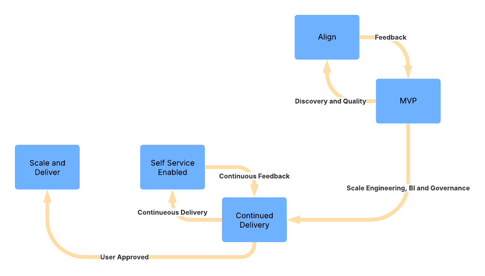

# Data Products as a Service (DPaaS)

This page will provide you with a view of Data products and my view on how to use it as a service.

## Table of Contents

- [1. Executive Summary](#1-executive-summary)
  - [What is Data Product as a Service](#what-is-data-product-as-a-service)
  - [Business Impact](#business-impact)
- [2. The Problem](#2-the-problem)
  - [Market Research](#market-research)
- [3. What: Defining Data Products as a Service](#3-what-defining-data-products-as-a-service)
  - [What is a Data Product?](#what-is-a-data-product)
  - [What is DPaaS?](#what-is-dpaas)
- [4. How DPaaS Works](#4-how-dpaas-works)
  - [Team Composition](#team-composition)
  - [Delivery Lifecycle](#delivery-lifecycle)
  - [Technology Stack](#technology-stack)
  - [How Is Different from Traditional Consulting](#how-is-different-from-traditional-consulting)
- [5. Case Study: CRM Migration at HBP](#5-case-study-crm-migration-at-hbp)
- [6. How DPaaS Supports Strategic Priorities](#6-how-dpaas-supports-strategic-priorities)
- [7. What’s Next](#7-whats-next)
- [8. Reference Architecture](#8-reference-architecture)
- [9. Optional Accelerators](#9-optional-accelerators)
  - [Advanced Analytics & ML Add-Ons](#advanced-analytics--ml-add-ons)
- [10. Important Links](#10-important-links)
  - [One Pager Link:](#one-pager-link)

## 1. Executive Summary
As organizations grow more data-driven, they often turn to consulting firms for specialized support in data engineering, governance, or analytics. Yet these services are frequently delivered in silos—each team working independently on fragmented solutions. This leads to duplicated effort, misaligned metrics, poor adoption, and reactive governance.

### What is Data Product as a Service
**Data Products as a Service (DPaaS)** is a unified, product-led consulting model that reduces rework, accelerates time-to-insight, and delivers governed, reusable data assets.

### Business Impact
- **40% faster** time to insight by aligning delivery teams from day one
- **3x higher** adoption of dashboards and KPIs across departments
- **30% less rework** by embedding governance and product vision upfront
- Designed for **self-service analytics** and **AI-readiness**

> _“DPaaS isn’t just a delivery model—it’s an accelerator for data trust, adoption, and reuse.”_

---

## 2. The Problem

Most consulting projects today are scoped and staffed around narrow work items. What’s missing is **the product**—a durable, discoverable, and trusted asset built with a business outcome in mind.

Many clients attempt **data democratization** without first establishing strong data products. This results in:

- Different departments defining the same KPIs differently  
- A lack of trust in data across teams  
- Repeated engineering of similar pipelines and logic  
- Underutilized tools and inconsistent adoption

Without a product-first foundation, democratization becomes chaos.

### Market Research

- **60%** of self-service BI initiatives fail due to lack of data trust (Gartner)  
- **40%** of analytics projects face delays from siloed delivery (McKinsey)  
- **70%** of rework stems from misaligned KPIs and delayed governance (internal benchmark)  
- $M wasted annually in re-engineering dashboards across business units (Forrester)

---

## 3. What: Defining Data Products as a Service

### What is a Data Product?
A data product is more than a dataset or dashboard. It is:

- **Discoverable** – searchable, documented, and known across teams  
- **Trustworthy** – tested, governed, and reliable  
- **Usable** – consumable by business users and analysts  
- **Reusable** – modular, scalable, and extendable  
- **Measurable** – with defined outcomes and usage metrics

### What is DPaaS?
**DPaaS** is a consulting-led, cross-functional offering where data engineering, analytics, and governance are bundled into a service model focused on delivering data products.

---

## 4. How DPaaS Works

> **DPaaS is not a sequence of phases—it’s a living product lifecycle.**  
> Teams work in short, iterative sprints, continuously evolving the data product based on business feedback, adoption metrics, and platform maturity.

### Team Composition
- **Client-Side**: Product Manager / Business SME  
- **Consulting Team**: Data Architect, Data Engineer, BI Developer, Governance Lead

### Product-Led Agile Lifecycle
1. Align on Opportunity  
   - Identify the business outcome and stakeholder needs  
   - Define KPIs, trust expectations, and success metrics  
   - Shape MVP scope and delivery backlog

2. Deliver MVP
   - Build MVP across engineering, BI, and governance  
   - Baseline discoverability, quality, and usability

3. Iterate based on feedback
   - Capture stakeholder feedback, adoption signals, and gaps  
   - Refine metrics, visuals, access patterns, and performance  
   - Continue delivering value every 2–3 weeks

4. Enable self-service  
   - Empower users with documentation, training, and support

5. Evolve and scale
   - Operationalize the product for scale (alerts, lineage, reuse)  
   - Extend to new use cases or audiences as needed

### Technology Stack 
- **Data Platforms**: Databricks, Snowflake 
- **Transformation**: dbt, Spark, ETL Tools 
- **Visualization**: Tableau, Power BI, Qlik  
- **Governance**: Atlan, Alation, Collebra
- **Product Management(If not already present)**: Jira, AHA, ProductBoard

### 	Supporting Practices

- **Shared Backlogs**: All roles contribute to a unified backlog of features and fixes  
- **Embedded Governance**: Validation, lineage, and documentation are part of “done”  
- **Stakeholder Reviews**: Sprint reviews and demos build continuous alignment  
- **Measurement**: Track adoption, feedback, and data product health as part of delivery

### How Is Different from Traditional Consulting

| Traditional Consulting         | Data Products as a Service (DPaaS)         |
|-------------------------------|---------------------------------------------|
| Siloed teams by function      | Cross-functional, product-led pods          |
| Task-based delivery           | Outcome-based product delivery              |
| Governance comes late         | Governance embedded from the start          |
| Metrics defined post-hoc      | KPIs defined during MVP design              |
| Reuse is accidental           | Reuse is intentional and strategic          |

---

## 5. Case Study: CRM Migration at HBP

**Initial Problem:**  
During a major CRM system migration, three separate consulting teams (engineering, BI, governance) were engaged in parallel. Their scopes were disconnected.

**What Went Wrong:**  

- Reporting requirements continued to shift until late in the project and were never fully aligned with upstream pipeline design
- The team lacked early visibility into business impact, making it difficult to assess integration needs and expected outcomes
- The governance team introduced policies that were not fully understood by stakeholders
- Dashboards were reworked multiple times due to inconsistencies between legacy and new systems
- Engineers were forced to rebuild data models to accommodate shifting downstream requirements

**How DPaaS Could Have Helped:**  
- One SME from the client could define reporting and governance vision  
- A cross-functional team could co-develop a product with shared understanding assimilating all the requirements defined by the SME and stake holders.
- MVPs could be iterated and trusted from day one.

**Estimated Impact:**  
- Rework reduced by ~30% or more 
- 6-week acceleration in delivery  
- Stronger trust in final delivery

---

## 6. How DPaaS Supports Strategic Priorities

- Enables **AI-readiness** by standardizing data products  
- Accelerates **self-service BI** through reusable and governed assets  
- Increases **trust in data** across departments  
- Positions your organization to scale **modern data platforms** effectively

---

## 7. What’s Next

- Identify a pilot use case or client  
- Package internal accelerators (KPI templates, starter kits)  
- Train consultants in DPaaS model and delivery practices  
- Launch a 6–12 week pilot to validate outcomes

### Example of DPaaS Readiness Assessment

- Do you have consistent KPIs across teams?  
- Are data engineering and BI aligned?  
- Do business users trust the data?  
- Is self-service adoption a challenge?

If “no” to 2 or more: You’re ready for DPaaS.

---

## 8. Reference Architecture

**Source Systems** → Ingestion (Airbyte, dbt) → Data Platform (Snowflake) →  
**Data Product Layer** → Consumption (BI tools, APIs) →  
**Governance Layer** (Lineage, Metadata, Access)

+----------------------------+
|     Consumption Layer      | ← Dashboards, APIs, Analysts
+----------------------------+
|     Data Product Layer     | ← Metric store, curated views, models
+----------------------------+
|  Data Platform & Pipeline  | ← Lakehouse, dbt, pipelines
+----------------------------+
|     Source Systems         | ← CRM, ERP, external data

---

## 9. Optional Accelerators

### Advanced Analytics & ML Add-Ons
- Pre-built ML model templates (churn, demand forecasting, etc.)
- Feature store integration for ML-enabled data products
- MLOps pipeline blueprints (MLflow, Vertex AI, Databricks ML)
- Model governance and monitoring toolkits

- Prebuilt KPI templates  
- Domain-specific data models  
- Integration blueprints  
- Governance startup kits

---

## 10. Important Links

### One Pager Link: 
- [DPaaS One Pager](/dpaas_one_pager_with_DS.md)